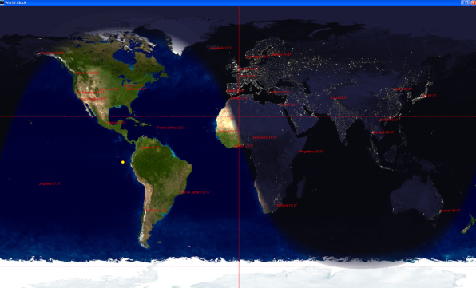

# Worldclock

 

[application](#application) -  [screensaver](#screensaver) - [configuration](#configuration) - [editor](#editor) - [panel](#panel) - [credits](#credits) - [attic](#attic)

Requires Java 7 or above.

## Application

A simple World Clock accessible from the system tray. Shows the time in cities arround the world.

### Downloads

* Zip:

 - [worldclockapplication-0.7.zip](https://dl.bintray.com/lhochet/Worldclock/worldclockapplication-0.7.zip)
* Installer:
  - [worldclockapplication-0.7-setup.exe](https://dl.bintray.com/lhochet/Worldclock/worldclockapplication-0.7-setup.exe)


### Run

Double click on worldclok(.jar) in the extraction directory or java -jar worldclock.jar in that directory

### Sources

*   see the [application](application) subproject


## Configuration

The application requires a configuration file.
That file is a simple XML file that can be easily edited via a text editor or via the [editor](#editor) application.
Basic structure of the file:

```xml
 <config>
   <planes>
     <plane name="ufo" horizontal="gauche" vertical="haut" image="pathto/ufo.png"/>
   </planes>
   <cities>
     <city name="Tours" lat="47.27" long="0.43" timezone="Europe/Paris"/>
   </cities>
 </config>

```

Planes:

*   name: name of the plane

*   horizontal: direction of the horizontal movement of the plane, gauche: towards the left, droite: towards the right

*   vertical: direction of the vertical movement of the plane, haut: towards the top, bas: towards the bottom

*   image: plane's image path relative to the configuration file

Cities:

*   lat: latitude, positive values: north, negative values: south

*   long: longitude, positive values: east, negative values: west

*   timezone: time zone in which the city is located (list)

See the [config.xml](config.xml) for some samples.

## Editor

An editor for the above configuration file.

### Downloads

*   Zip:

    *   [worldclockeditor-1.0.zip](https://dl.bintray.com/lhochet/Worldclock/worldclockeditor-1.0.zip)
*   Installer

    *   [worldclockeditor-1.0-setup.exe](https://dl.bintray.com/lhochet/Worldclock/worldclockeditor-1.0-setup.exe)

### Run

Double click on worldclokeditor(.jar) in the extraction directory or java -jar worldclockeditor.jar in that directory

### Sources

*   see the [editor](editor) subproject

## Panel

A World day and night JPanel to be used in Swing applications.

### Downloads

*   Jar:

    *   [panel-0.7.jar](https://dl.bintray.com/lhochet/Worldclock/panel-0.7.jar)

### Sources

*   see the [panel](panel) subproject

## Team

*   [Ludovic Hochet](https://github.com/lhochet)
*   [Guus der Kinderen](https://github.com/guusdk)

## Credits

*   Jürgen Giesen, for his [Day & Night Applet](http://www.geoastro.de/TNApplet/DN/index.html) that serves as the base for the world clock board

*   NASA, for the Earth pictures (more at [NASA's Visible Earth](http://visibleearth.nasa.gov/) website)

## Attic

In the attic:

*   a desklet for Glossitope

*   a widget for WidgetFX

*   an OpenTool for JBuilder

*   a module for Netbeans

*   a plugin for Eclipse

*   a screensaver

see the [attic](attic) for the source code